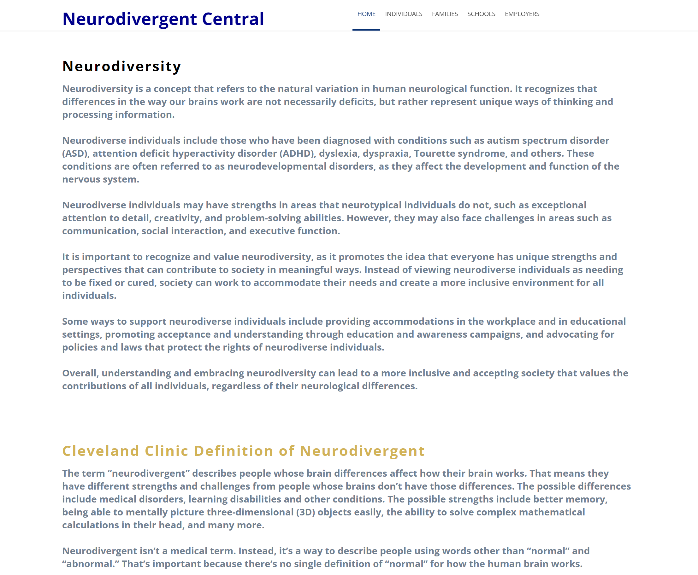

# :zap: Neurodivergent Central

* Converts a free Namari HTML template to an Angular app
* **Note:** to open web links in a new window use: _ctrl+click on link_


## :page_facing_up: Table of contents

* [:zap: Angular Website Example](#zap-angular-website-example)
  * [:page\_facing\_up: Table of contents](#page_facing_up-table-of-contents)
  * [:books: General info](#books-general-info)
  * [:camera: Screenshots](#camera-screenshots)
  * [:signal\_strength: Technologies](#signal_strength-technologies)
  * [:floppy\_disk: Setup](#floppy_disk-setup)
  * [:computer: Code Examples](#computer-code-examples)
  * [:file\_folder: License](#file_folder-license)
  * [:envelope: Contact](#envelope-contact)

## :books: General info

* [Angular feature modules](https://angular.io/guide/feature-modules) used for organisational best practise
* Single service used to fetch data for all pages so this data can be accessed from an API. This meant I could not use custom interface classes. Each module should have its own service with interface class.

## :camera: Screenshots

.

## :signal_strength: Technologies

* [Angular v15](https://angular.io/) JS framework
* [Font Awesome v4](https://fontawesome.com/) icons
* [RxJS Library v7](https://angular.io/guide/rx-library) used to [subscribe](http://reactivex.io/documentation/operators/subscribe.html) to the API data [observable](http://reactivex.io/documentation/observable.html).
* [The HttpClient in @angular/common/http](https://angular.io/guide/http) offers a simplified client HTTP API for Angular applications that rests on the XMLHttpRequest interface exposed by browsers.

## :floppy_disk: Setup

* Run `npm i` to install dependencies.
* Run `ng serve` for a dev server.
* Navigate to `http://localhost:4200/`. The app will automatically reload if you change any of the source files.

## :computer: Code Examples

* `shared/services/config.service.ts` function to get data from API with inputs: database name and id

```typescript
getSettings(database: string, id?: number): Observable<any> {
  let url = id? `api/${database}/${id}` : `api/${database}`;
  return this.http.get<any>(url).pipe(
    catchError(this.handleError(`Error getting data from ${database}`, []))
  );
}
```

## :file_folder: License

* N/A

## :envelope: Contact

* Repo created by [smcfarlane49](https://github.com/smcfarlane49)
